# 🏡 House View - Real Estate Listing Platform

House View is a web application built with Laravel 11 and Filament v3, designed to streamline the management and viewing of real estate listings. Administrators have full CRUD capabilities over house details (for sale or rent), while registered users can browse available properties and view their dashboard.

---

## 🚀 Features

**Admin Panel (Filament):**
*   🔐 **Secure Admin Login:** Dedicated admin panel access.
*   🏠 **House Management:** Full CRUD operations (Create, Read, Update, Delete) for house listings.
*   📝 **Detailed Listings:** Manage property details like address, price, status (For Sale/For Rent), number of bedrooms/bathrooms, description, images, etc.
*   📊 **Admin Dashboard:** Overview widgets summarizing key information (e.g., total listings, recent additions).
*   👤 **(Optional) User Management:** Admins might also manage registered user accounts.

**User Portal:**
*   🔑 **User Registration & Login:** Secure user account creation and authentication (potentially using Laravel Passport for API tokens if needed, or standard web sessions).
*   👀 **View House Listings:** Browse published properties with filtering/searching capabilities (if implemented).
*   ℹ️ **View House Details:** Access detailed information about specific properties.
*   👤 **User Dashboard:** A simple dashboard for registered users (e.g., view profile info, saved listings - if implemented).
*   🔒 **View-Only Access:** Users cannot modify property listings.

**General:**
*   ⚡ **Modern Stack:** Built with Laravel 11 & PHP 8.2+.
*   🎨 **Admin UI:** Clean and efficient admin interface powered by Filament v3.
*   📱 **Responsive Design:** Accessible on various devices (thanks to Filament/Tailwind).
*   🔐 **API Ready (Optional):** Laravel Passport included for potential future API integrations or if user auth is API-driven.

---

## 🏗️ Tech Stack

*   **Framework**: Laravel 11 (PHP 8.2+)
*   **Admin Panel**: Filament v3
*   **API Authentication**: Laravel Passport (if used for user auth or APIs)
*   **Database**: MySQL / PostgreSQL (Configurable)
*   **Frontend (User)**: Blade Templating
*   **Styling**: Tailwind CSS (via Filament & potentially for user views)
*   **Asset Bundling**: Vite

---

## 📸 Screenshots

<!-- Create a directory like public/images or resources/images/screenshots and place your screenshots there -->
<!-- Update the paths below accordingly -->

### 🔑 User Login Page
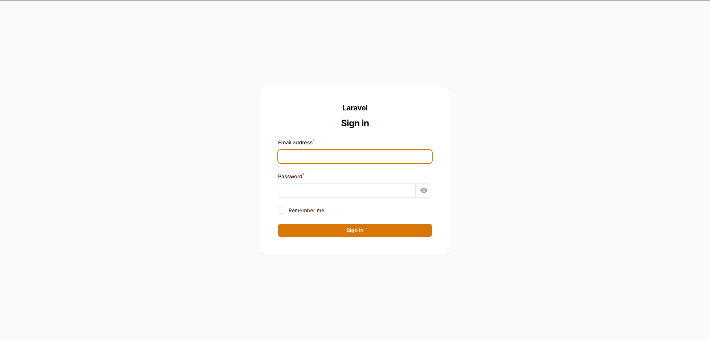

### ✍️ User Registration Page
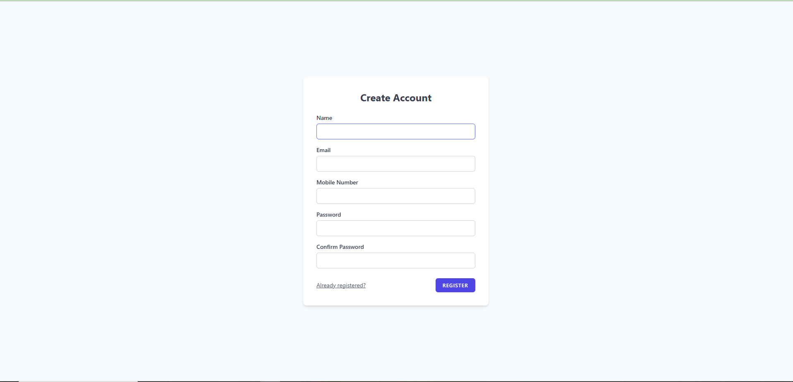

### 🏠 User House Listing View


### ℹ️ User House Detail View


### 👤 User Dashboard
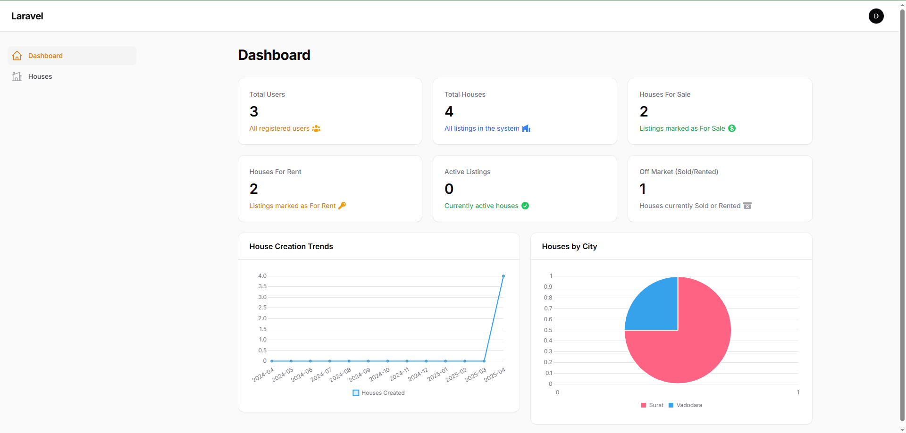

### 🔒 Admin Login Page (Filament)


### 📊 Admin Dashboard (Filament)
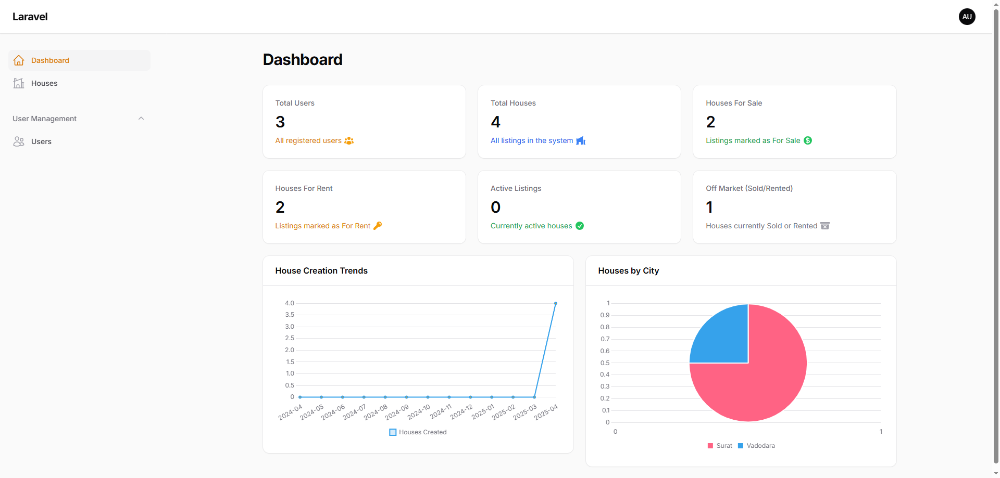

### 📊 Admin User Access Dashboard (Filament)
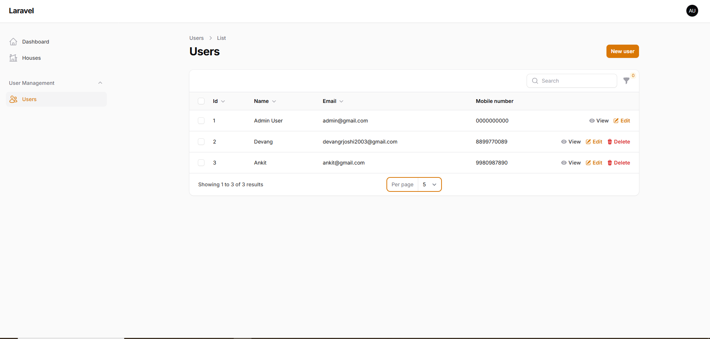

### 📊 Admin House Listing View (Filament)
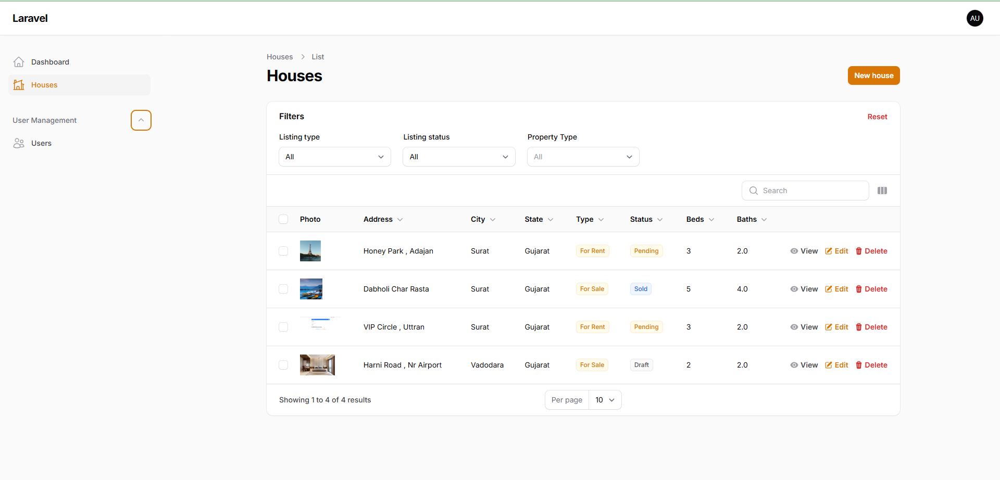

### 📋 Admin House Management (Filament Resource)
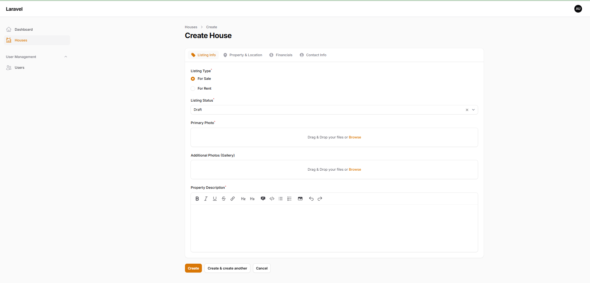

### 📋 Admin House Management (Filament Resource)
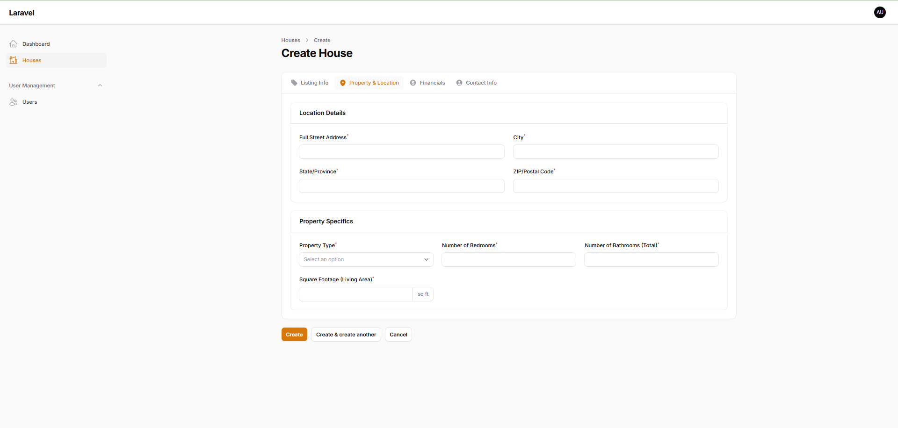

### 📋 Admin House Management (Filament Resource)
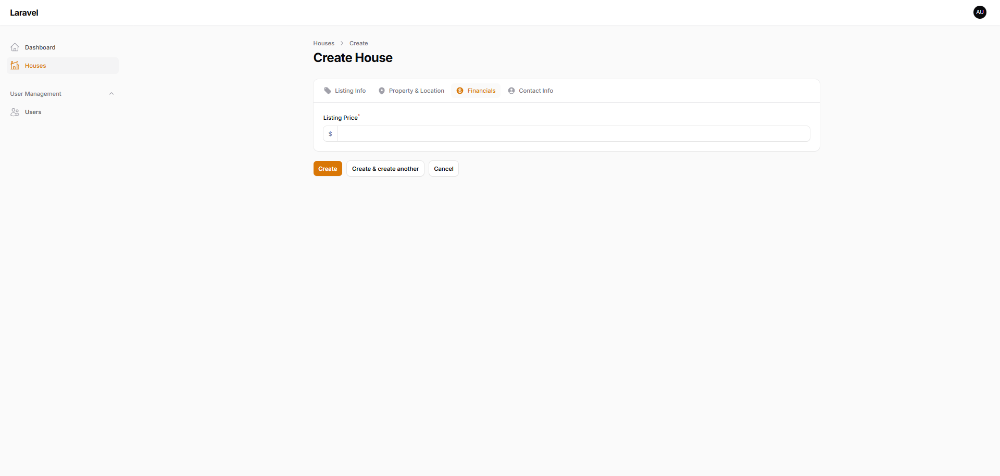

### 📋 Admin House Management (Filament Resource)
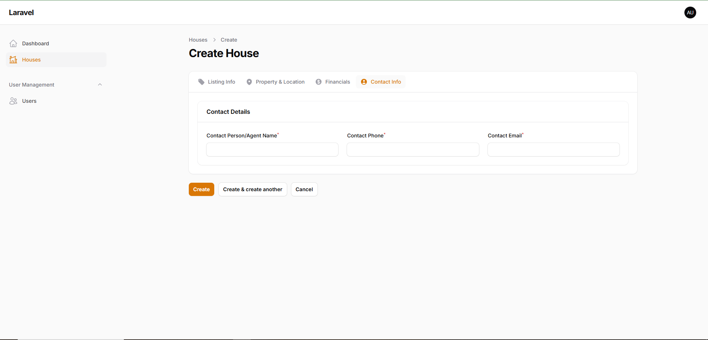

### ✏️ Admin House Edit Form (Filament Resource)
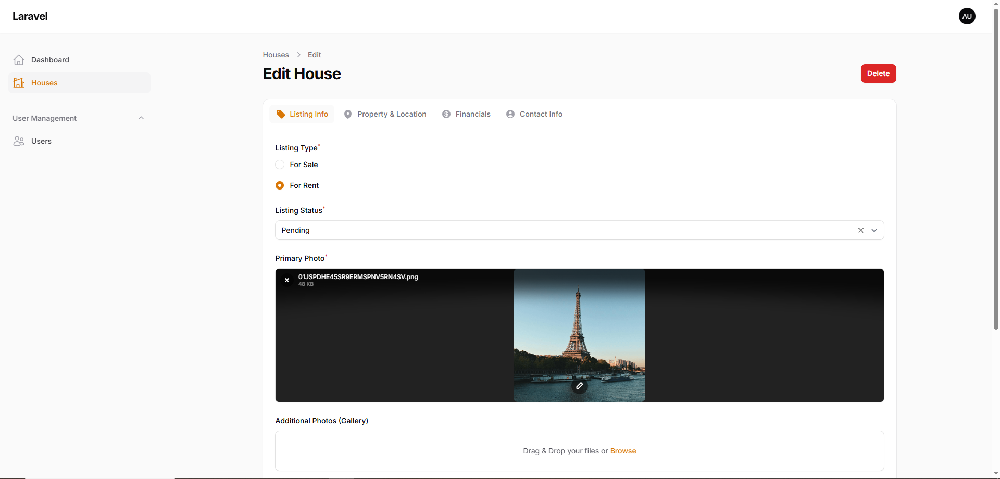

---

## 🛠️ Installation

1.  **Clone the repository:**
    <!-- Replace `your-username/house-view.git` with your actual repository URL -->
    ```bash
    git clone https://github.com/your-username/house-view.git
    cd house-view
    ```

2.  **Install PHP Dependencies:**
    ```bash
    composer install
    ```

3.  **Install Node.js Dependencies & Build Assets:**
    ```bash
    npm install
    npm run build # Or use 'npm run dev' for development
    ```

4.  **Set up Environment File:**
    Copy the example environment file and generate the application key.
    ```bash
    cp .env.example .env
    php artisan key:generate
    ```

5.  **Configure Environment (`.env` file):**
    Open the `.env` file and update the following:
    *   **Database Connection:** Set `DB_CONNECTION`, `DB_HOST`, `DB_PORT`, `DB_DATABASE`, `DB_USERNAME`, `DB_PASSWORD`.
    *   **Application URL:** Set `APP_URL` to your local development URL (e.g., `APP_URL=http://localhost:8000` or `APP_URL=http://house-view.test`). This is important for Filament and other parts of Laravel.

    ```env
    APP_NAME="House View"
    APP_ENV=local
    APP_KEY=base64:... # Should be already generated
    APP_DEBUG=true
    APP_URL=http://localhost:8000 # Set this correctly

    DB_CONNECTION=mysql
    DB_HOST=127.0.0.1
    DB_PORT=3306
    DB_DATABASE=house_view # Or your database name
    DB_USERNAME=root       # Or your database username
    DB_PASSWORD=           # Or your database password

    # Add other necessary env variables (Mail, etc.)
    ```

6.  **Run Database Migrations:**
    This will create the necessary tables, including users, password resets, Filament tables, Passport tables, and your `houses` table (assuming you have a migration for it).
    ```bash
    php artisan migrate
    ```

7.  **Install Laravel Passport (If used for User Auth/API):**
    *Note: If you are only using Filament's built-in auth for the admin panel and Laravel's standard web auth for users, you might not strictly need Passport unless you plan APIs. If you installed it, run these commands.*
    ```bash
    # Skip 'composer require' if already installed via composer.json
    # composer require laravel/passport

    # Run migrations if not already done in the previous step
    # php artisan migrate

    # Install Passport keys and clients
    php artisan passport:install --uuids
    ```
    *   Ensure your `App\Models\User` model uses the `Laravel\Passport\HasApiTokens` trait if you intend to use Passport for API token authentication.
    *   Ensure `App\Providers\AuthServiceProvider` registers Passport routes: `Passport::routes();`

8.  **Install Filament:**
    *Note: If Filament is already installed via `composer.json`, you might just need the install command.*
    ```bash
    # Skip 'composer require' if already installed
    # composer require filament/filament:"^3.2" -W

    # Run the install command to publish assets and configuration
    php artisan filament:install --panels
    ```
    *   This command sets up the necessary configurations, service providers, and assets for Filament. It typically creates an Admin Panel Provider in `app/Providers/Filament/AdminPanelProvider.php`.

9.  **Create Admin User (Filament):**
    Filament doesn't usually come with a default user. You need to create one. You can do this via a seeder or using Tinker:
    ```bash
    php artisan tinker
    ```
    Then inside Tinker:
    ```php
    // Make sure your User model has necessary fields (name, email, password)
    // and potentially a flag like 'is_admin' or uses permissions/roles
    // to grant access to the Filament panel.

    // Example (adjust based on your User model and Filament access control):
    \App\Models\User::create([
        'name' => 'Admin User',
        'email' => 'admin@example.com',
        'password' => bcrypt('password'), // Change 'password' to a secure password
        // Add any other required fields, e.g., 'is_admin' => true
    ]);
    ```
    *   Ensure your `AdminPanelProvider.php` correctly authorizes users (e.g., checking the `is_admin` flag or using a role/permission).

10. **(Optional) Seed Database:**
    If you have database seeders to populate initial data (e.g., sample houses, user roles), run:
    ```bash
    php artisan db:seed
    ```
11. **## 📁 Project Structure:**
    ```
├── app
│   ├── Enums
│   │   ├── ListingStatus.php
│   │   ├── ListingType.php
│   │   └── RentalPeriod.php
│   ├── Filament
│   │   └── Resources
│   │       ├── HouseResource
│   │       │   ├── Pages
│   │       │   └── Widgets
│   │       ├── HouseResource.php
│   │       ├── UserResource
│   │       │   └── Pages
│   │       └── UserResource.php
│   └── Http
│       └── Controllers
│           ├── Auth
│           ├── Controller.php
│           ├── Models
│           ├── Policies
│           └── Providers
├── bootstrap
├── config
├── database
├── public
├── resources
├── routes
├── storage
├── tests
├── vendor
├── .editorconfig
├── .env
├── .env.example
├── .gitattributes
├── .gitignore
├── .md
├── artisan
├── composer.json
├── composer.lock
├── package.json
├── phpunit.xml
├── README.md
└── vite.config.js
    ```
    
    
12. **Serve the Application:**
    ```bash
    php artisan serve
    ```

Visit `http://localhost:8000` (or the URL configured in `APP_URL` and provided by `php artisan serve`).
*   **Admin Panel:** Typically available at `/admin` (or the path configured in your `AdminPanelProvider.php`).
*   **User Routes:** Access registration (`/register`), login (`/login`), and other user-facing pages as defined in your `routes/web.php`.

---

## ✨ Filament Commands

Here are some common Artisan commands provided by Filament v3 for creating components:

*   **Create a new Panel:**
    *   If you need additional admin panels beyond the default one.
    *   `php artisan make:filament-panel <PanelName>`
    *   Example: `php artisan make:filament-panel Manager --simple`

*   **Create a Resource:**
    *   Generates List, Create, Edit, and View pages for a Model. This is the core for CRUD operations.
    *   `php artisan make:filament-resource <ResourceName> --generate`
    *   Example: `php artisan make:filament-resource House --generate` (This assumes you have an `App\Models\House` model).

*   **Create a Page:**
    *   For custom pages within your Filament panel that aren't tied directly to a model's CRUD operations.
    *   `php artisan make:filament-page <PageName> --panel=<PanelID>`
    *   Example: `php artisan make:filament-page Settings --panel=admin`

*   **Create a Widget:**
    *   For displaying stats or information on dashboards.
    *   `php artisan make:filament-widget <WidgetName> --panel=<PanelID>`
    *   Example (Stats Overview Widget): `php artisan make:filament-widget StatsOverview --stats-overview --panel=admin`
    *   Example (Chart Widget): `php artisan make:filament-widget HousesChart --chart --panel=admin`
    *   Example (Table Widget): `php artisan make:filament-widget LatestHouses --table --panel=admin`

*   **Create a Form Field:**
    *   `php artisan make:filament-form-field <FieldName>`

*   **Create a Table Column:**
    *   `php artisan make:filament-table-column <ColumnName>`

*Refer to the [Filament Documentation](https://filamentphp.com/docs/3.x/panels/installation) for detailed usage and more commands.*

---

## 🔄 Usage Workflow

1.  **Admin:**
    *   Navigate to the admin login URL (e.g., `/admin`).
    *   Log in using the credentials created during setup.
    *   Access the Admin Dashboard.
    *   Use the navigation menu (usually on the left) to find "Houses" (or your resource name).
    *   Perform Create, Read, Update, or Delete operations on house listings.

2.  **User:**
    *   Navigate to the main application URL (e.g., `/`).
    *   Register for a new account via the `/register` link.
    *   Log in using the `/login` link.
    *   Upon successful login, you might be redirected to a user dashboard or the main house listings page.
    *   Browse available houses.
    *   Click on a listing to view its details.

---

## 🤝 Contributing

Pull requests are welcome. For major changes, please open an issue first to discuss what you would like to change. Please ensure to update tests as appropriate.

1.  Fork the Project
2.  Create your Feature Branch (`git checkout -b feature/AmazingFeature`)
3.  Commit your Changes (`git commit -m 'Add some AmazingFeature'`)
4.  Push to the Branch (`git push origin feature/AmazingFeature`)
5.  Open a Pull Request

---

## 📄 License

This project is open-sourced under the MIT license. See the `LICENSE` file for more details (if one exists).

---
